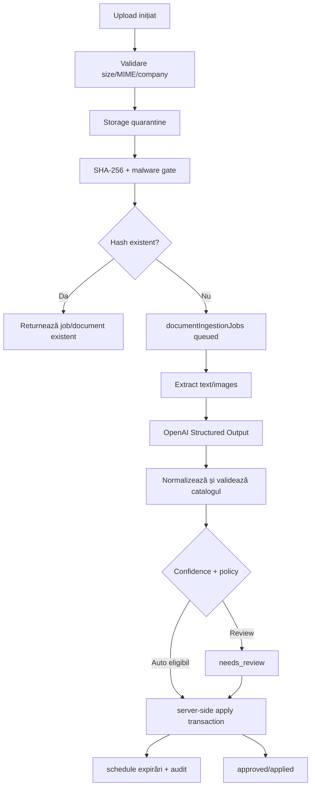

# Document Intelligence Architecture

## 1. Principii

1. Fișierul original, extracția și aplicarea datelor sunt operații distincte.
2. AI produce un draft structurat; nu scrie direct entitatea de business.
3. Identitatea companiei și actorului vine din Auth/server, nu din payload.
4. Fiecare câmp are valoare, tip, confidence, provenance și validare.
5. Același fișier și aceeași versiune de extractor nu se procesează de două ori.
6. Aplicarea este tranzacțională, auditată și reversibilă.
7. Auto-apply este opt-in per companie, document type și field.
8. GPS, simularea și traseele nu fac parte din document intelligence.

## 2. Flux end-to-end



## 2.1 Registrul inițial de tipuri

Registrul este versionat și allowlisted. Tipurile inițiale sunt:

- `vehicle_registration_certificate` - talon;
- `vehicle_identity_card` - cartea de identitate a vehiculului;
- `rca`;
- `casco`;
- `rovinieta`;
- `itp`;
- `leasing_contract`;
- `service_invoice`;
- `purchase_invoice`;
- `receipt`;
- `tool_invoice`;
- `tool_warranty`;
- `maintenance_contract`;
- `lift_document`;
- `unknown`.

Fiecare definiție declară schema permisă, câmpurile obligatorii, validările, entitățile
compatibile, mapping-ul către catalog și pragurile de confidence. `unknown` nu poate aplica
niciun câmp.

## 3. Colecția `documentIngestionJobs`

```ts
type DocumentIngestionJob = {
  id: string;
  companyId: string;
  uploaderUserId: string;
  entityType: "vehicle" | "tool" | "maintenanceLift" | "expense";
  entityId: string;
  sourceModule: "vehicles" | "tools" | "maintenance" | "expenses";

  storagePath: string;
  sourceFileName: string;
  mimeType: string;
  sizeBytes: number;
  sha256: string;
  dedupeKey: string; // companyId + sha256 + extractionVersion + schemaVersion
  idempotencyKey: string;

  status:
    | "queued"
    | "validating"
    | "extracting"
    | "needs_review"
    | "approved"
    | "applying"
    | "applied"
    | "rejected"
    | "failed";
  attempt: number;
  maxAttempts: number;
  leaseOwner?: string;
  leaseExpiresAt?: Timestamp;
  error?: { code: string; safeMessage: string; retryable: boolean };

  documentType?: string;
  documentTypeConfidence?: number;
  fieldResults: DocumentFieldResult[];
  extractedFields: Record<string, unknown>;
  normalizedFields: Record<string, unknown>;
  fieldConfidence: Record<string, number>;
  proposedChanges: Array<{ field: string; before: unknown; after: unknown }>;
  appliedChanges: Array<{ field: string; before: unknown; after: unknown }>;
  notificationProposal?: {
    preset: "standard" | "minimal" | "insistent" | "custom" | "none";
    thresholdsDays: number[];
  };
  warnings: string[];
  missingRequiredFields: string[];

  model: string;
  extractionVersion: string;
  schemaVersion: string;
  promptVersion: string;
  usage?: { inputTokens: number; outputTokens: number; cachedInputTokens?: number };
  estimatedCostUsd?: number;

  automationMode: "review_all" | "auto_high_confidence" | "full_auto_with_rollback";
  reviewedByUserId?: string;
  reviewedAt?: Timestamp;
  appliedByUserId?: string;
  appliedAt?: Timestamp;
  applyOperationId?: string;

  createdAt: Timestamp;
  updatedAt: Timestamp;
  expiresAt?: Timestamp;
};

type DocumentFieldResult = {
  field: string;
  value: unknown;
  normalizedValue: unknown;
  valueType: "string" | "number" | "date" | "currency" | "array";
  confidence: number;
  sourcePage?: number;
  sourceText?: string; // scurt, fără document brut
  status: "suggested" | "accepted" | "rejected" | "unsupported" | "invalid";
  validationErrors: string[];
};
```

### Indexuri

- `companyId + status + createdAt desc`;
- `companyId + entityType + entityId + createdAt desc`;
- `companyId + dedupeKey` unic logic;
- `status + leaseExpiresAt` pentru recovery;
- TTL pe `expiresAt` numai pentru job, nu pentru documentul aprobat.

## 4. Document metadata

Fiecare modul păstrează documentele într-o subcolecție, cu un contract comun:

```text
{entityCollection}/{entityId}/documents/{documentId}
```

Câmpurile comune includ `companyId`, `entityType`, `entityId`, `storagePath`, `sha256`,
tip, perioadă de valabilitate, status, review, provenance, jobId și timestamps. Entitatea
părinte păstrează doar:

```ts
documentSummary: {
  count: number;
  nextExpiryAt: Timestamp | null;
  expiredCount: number;
  needsReviewCount: number;
  updatedAt: Timestamp;
}
```

Pentru vehicule se păstrează temporar adaptorul pentru array-ul legacy `documents`, dar
listele și operational views nu trebuie să transporte documentele complete.

## 5. Idempotency și dedupe

- hash calculat server-side după upload;
- `dedupeKey = companyId:sha256:extractionVersion:schemaVersion`;
- create job prin transaction; dacă cheia există, returnează jobul existent;
- worker-ul ia lease și verifică statusul înainte de procesare;
- apply folosește `applyOperationId`, iar tranzacția refuză operația deja aplicată;
- notification schedule folosește `documentId:ruleType:threshold:validUntil`;
- retry nu creează alt expense/document.

## 6. Moduri de automatizare

### `review_all`

- toate câmpurile sunt afișate comparativ `vechi -> propus`;
- utilizatorul acceptă/rejectează pe câmp;
- entitatea este rezolvată explicit;
- schimbările sensibile cer confirmare suplimentară;
- serverul validează din nou înainte de apply.

### `auto_high_confidence` - implicit recomandat

Aplică numai câmpurile allowlisted și sigure. Restul intră în review. Este permis numai
pentru:

- companie cu policy activă;
- document type stabil;
- câmp allowlisted;
- confidence per câmp peste prag;
- entitate identificată unic prin ID/VIN/plate/serial;
- valoare calendaristică/semantică validă;
- fără conflict cu o valoare manuală mai nouă.

Inițial se activează numai pentru date de expirare, cu prag >=0,95. Identificatori,
companie, asignări, status, kilometraj și valori financiare nu sunt auto-applied.

### `full_auto_with_rollback`

Opt-in explicit per companie și document type. Necesită entitate identificată sigur,
before/after complet, operation ID și rollback. Nu suprascrie o valoare verificată manual,
mai nouă sau diferită fără regulă explicită. Nu se recomandă în primul rollout.

## 7. Rollback

La apply, Function salvează:

```ts
documentApplyOperations/{operationId} {
  companyId,
  entityType,
  entityId,
  documentId,
  jobId,
  patch,
  before,
  after,
  actorUserId,
  appliedAt,
  status: "applied" | "rolled_back",
  rolledBackByUserId?,
  rolledBackAt?
}
```

Rollback-ul rulează server-side, verifică faptul că valoarea curentă încă este `after` și
nu suprascrie o editare ulterioară. Dacă există conflict, cere rezolvare manuală.

## 8. Mapping exact pe tip de document

### Talon / certificat de înmatriculare

| Valoare extrasă | Câmp actual | Politică |
| --- | --- | --- |
| număr înmatriculare | `plateNumber` | review, normalizare, verificare unicitate |
| VIN/serie șasiu | `vin` | review, match unic |
| marcă | `brand` | review |
| model/tip | `model` | review |
| an fabricație | `year` | review dacă este explicit |
| combustibil | `fuelType` | review |
| prima înmatriculare | inexistent | păstrează în draft până la schemă nouă |
| cilindree/putere/culoare/masă | inexistente | draft unsupported, fără write |

Talonul nu schimbă owner-ul WorkControl, driverul, statusul sau compania.

### RCA

| Valoare | Destinație |
| --- | --- |
| expirare | `nextRcaDate` + document `validUntil` |
| emitere/start | document `issueDate`/`validFrom` |
| număr poliță | document `policyNumber` |
| asigurător | document `providerName` |
| număr înmatriculare | identificare/review, nu update automat |

### Rovinietă

| Valoare | Destinație |
| --- | --- |
| expirare | `nextRovinietaDate` + `validUntil` |
| început valabilitate | document `validFrom` |
| număr/serie | metadata document propusă |
| număr înmatriculare/VIN | identificare și conflict check |

### ITP

| Valoare | Destinație |
| --- | --- |
| expirare | `nextItpDate` + `validUntil` |
| data inspecției | document `issueDate` |
| serie/certificat | metadata document propusă |
| rezultat | metadata; nu schimbă automat `status` vehicul |

### CASCO

| Valoare | Destinație |
| --- | --- |
| expirare | `nextCascoDate` + `validUntil` |
| număr poliță | document `policyNumber` |
| asigurător | document `providerName` |
| perioadă | `validFrom`/`validUntil` |
| valoare asigurată/franșiză | propus, fără câmp actual |

### Factură / fișă service auto

| Valoare | Destinație | Politică |
| --- | --- | --- |
| data service | document metadata | review |
| furnizor | `providerName` / metadata | review |
| număr factură | metadata propusă | review |
| kilometraj | sugestie pentru `currentKm` | niciodată auto; nu poate scădea km |
| următor service km | `nextServiceKm` | review strict |
| următor schimb ulei | `nextOilServiceKm` | review strict |
| operații/piese | service history propus | nu concatena automat în notes |
| total/TVA | expense flow dacă se creează cheltuială | confirmare și dedupe cross-module |

## 9. OpenAI contract

- Responses API cu Structured Outputs și JSON Schema strict;
- schema generată din același catalog folosit de validator;
- model implicit inițial: `gpt-4.1-mini`, configurabil server-side;
- input image/PDF prin file input sau data/file ID, fără URL public permanent;
- nu se loghează documentul sau textul integral;
- se salvează `usage`, model și versiuni;
- orice refusal sau output invalid produce `needs_review`/`failed`, niciodată write parțial.

Documentație oficială:

- <https://developers.openai.com/api/docs/guides/structured-outputs>
- <https://developers.openai.com/api/docs/guides/images-vision>
- <https://developers.openai.com/api/docs/guides/file-inputs>

## 9.1 Strategie de cost și calitate

- clasificare cu model ieftin și output minim;
- extracție completă numai după clasificare și dedupe;
- escaladare la un model mai capabil numai pentru confidence mic/conflict;
- limită de pagini PDF și rezoluție normalizată;
- thumbnail/preview o singură dată;
- cache după `sha256 + extractionVersion + schemaVersion`;
- zero OCR repetat la simpla redeschidere;
- reprocess numai manual sau la upgrade de extractor;
- token usage și cost estimat salvate per job.

Pe lângă costul modelului, fiecare document produce operații Storage, 3-8 writes de stare,
1-3 reads de validare și eventual notificări. La volum mic, modelul domină costul per
document; la volum mare, păstrarea originalelor și downloadurile de preview devin
relevante. Bugetul inițial recomandat este sub 0,02 USD/document mediu, cu alertă dacă un
job depășește 25k tokeni input sau trei încercări.

## 9.2 UX desktop și mobil

### Vehicle Details -> Documente

- acțiune principală `Scanează document`;
- cameră pe mobil și galerie/PDF;
- cards cu tip, perioadă, status și entitate;
- statusuri: În procesare, Necesită verificare, Aplicat automat, Expiră curând, Expirat,
  Eroare;
- preview al originalului lângă datele extrase;
- tabel `valoare actuală -> propunere`, confidence și sursă;
- confirmare per câmp, rollback și configurare notificări;
- istoric replace/supersede fără carduri nested.

### Global Document Inbox

Admin/manager vede paginat: documente noi, neasociate, confidence mic, conflicte,
expirări, erori și duplicate. Filtrele sunt server-side după companie, modul, status,
uploader, tip și interval. Acțiunile bulk se limitează la reject/retry/assign; apply bulk nu
este activ în prima versiune.

### Expiry Center

Vederi calendar/listă/timeline pentru RCA, CASCO, ITP, rovinietă, garanții, contracte și
documente lift. Datele vin din `documentSummary` și `notificationSchedules`, nu din full
scan în browser. Quick actions: deschide entitatea, înlocuiește documentul, schimbă presetul,
marchează rezolvat.

### Mobile flow

1. Mașina mea -> Documente;
2. Scanează document;
3. cameră/gallery/PDF;
4. detectare automată;
5. preview;
6. date extrase și conflicte;
7. preset notificare;
8. confirmare;
9. succes cu link către document și undo dacă apply a avut loc.

Layoutul folosește o coloană, sticky action bar, touch targets de minimum 44 px și nu
afișează JSON/debug utilizatorului normal.

## 10. Securitate

- callable/trigger server-side verifică Auth, active status, role și company;
- Storage path se derivă server-side și trebuie să corespundă entității;
- App Check controlat;
- originalele nu sunt publice;
- conținutul nu intră în audit logs;
- auditul păstrează numai metadata, câmpuri modificate și IDs;
- reguli deny-by-default pentru jobs, apply operations și schedules;
- doar owner/manager eligibil vede documentul; tracker/GPS metadata rămâne separată;
- producția nu se extinde înainte de reconcilierea rules P0.

## 11. Teste obligatorii

- fișier duplicat și retry concurent;
- MIME fals, oversized, path traversal;
- user cross-company;
- document pentru entitate greșită;
- dată invalidă/rollover/DST;
- confidence mic și câmp unsupported;
- auto mode allowlist și conflict cu editare manuală;
- rollback cu și fără conflict;
- worker reentrant/lease expirat;
- cleanup Storage după eșec;
- cost/usage persistat fără conținut sensibil.
