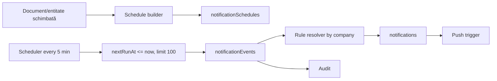

# Notification Automation Architecture

## 1. Situația actuală

WorkControl are deja:

- `NotificationRuleItem` cu module, evenimente, program, repetare și destinatari;
- dispatch server-side controlat cu allowlist/rate limit în fundația de securitate;
- notificări Firestore și push la `onDocumentCreated`;
- scheduled reminders pentru pontaje, mentenanță auto și piese;
- audit server-side pentru evenimente și livrări;
- retenție redusă în inboxul utilizatorului.

Problemele curente:

- există logică de scheduling în mai multe Functions;
- contextul legacy citește toți utilizatorii și toate regulile active;
- `checkVehicleMaintenanceAlerts` face full scan pe vehicule;
- idempotency diferă între tipuri de reminder;
- regulă, schedule concret, event și delivery nu sunt separate clar;
- expirările documentelor noi ar multiplica scanările dacă sunt adăugate direct.

## 2. Model țintă



### Colecții

Modelul canonic V4 folosește cinci concepte. `notificationRules` existent devine adaptor
temporar pentru `notificationPolicies`; nu se păstrează două motoare active.

#### `notificationPolicies/{policyId}`

Politica centrală de livrare și expirare. În prima migrare poate fi materializată din
`notificationRules`, apoi UI-ul scrie numai prin Function.

#### `automationRules/{automationRuleId}`

Leagă un eveniment/sursă de o policy și de acțiuni allowlisted. Nu conține cod, query sau
path arbitrar furnizat de utilizator.

#### `notificationRules/{ruleId}`

Model legacy: eveniment, praguri, canal, destinatari, program și activare. Este citit prin
adapter până la migrarea completă în `notificationPolicies`.

#### `notificationSchedules/{scheduleId}`

Instanță concretă indexată:

```ts
{
  companyId,
  ruleId,
  sourceType,
  sourceId,
  documentId,
  dateField,
  targetDate,
  thresholdDays,
  nextRunAt,
  timezone: "Europe/Bucharest",
  status: "active" | "processing" | "completed" | "cancelled",
  dedupeKey,
  version,
  lastEvaluatedAt,
  createdAt,
  updatedAt
}
```

#### `notificationEvents/{eventId}`

Eveniment immutable, server-side, fără mesaj arbitrar din client. Include source, actor,
company, eventType, dedupeKey și payload allowlisted.

#### `notificationDeliveries/{deliveryId}`

Stare per user/canal: queued, delivered, failed, read; retry controlat și token invalid.
Poate fi păstrată separat de inbox pentru observabilitate, cu TTL.

## 3. Evenimente document intelligence

Evenimente noi recomandate:

- `document_uploaded`;
- `document_needs_review`;
- `document_applied`;
- `document_rejected`;
- `document_expiry_due_soon`;
- `document_expired`;
- `document_replaced`;
- `document_processing_failed`.

Acestea completează evenimentele existente pentru ITP, RCA, CASCO și rovinietă. În
perioada de migrare, un singur adapter emite evenimentul canonic pentru a evita duplicate.

## 4. Praguri recomandate

| Tip | Praguri implicite | Destinatari impliciți |
| --- | --- | --- |
| RCA/CASCO/ITP/rovinietă | 30, 14, 7, 1, 0 zile | owner, driver, manager |
| Lift inspection | 60, 30, 14, 7, 0 zile | manager mentenanță, tehnician configurat |
| Contract mentenanță | 60, 30, 7, 0 zile | manager |
| Tool warranty | 30, 7, 0 zile | owner/holder, manager |
| Expense due date | 7, 3, 1, 0 zile | uploader/assigned, manager financiar |
| Document needs review | imediat + digest 24h | uploader, manager relevant |

Pragurile sunt configurabile per companie. Scheduler-ul nu presupune că toate firmele au
aceleași reguli.

### Preseturi UI

| Preset | Praguri | Repetare |
| --- | --- | --- |
| Standard | 30, 14, 7, 3, 1, 0 zile | o notificare per prag |
| Minimal | 14, 3, 0 zile | o notificare per prag |
| Insistent | 60, 30, 14, 7, 3, 2, 1, 0 zile | după expirare până la confirmare, limitat |
| Custom | zile/oră/canale/destinatari configurabile | conform policy și rate limit |

După extracție, UI-ul întreabă: „Am identificat expirarea RCA la 20.09.2026. Cum
programez notificările?” și oferă Standard, Minimal, Insistent, Personalizat și Nu
programa.

Canalele țintă sunt in-app și push în prima etapă; emailul se activează numai după
configurarea expeditorului, consent/retention și observabilitate. Destinatarii posibili sunt
șoferul curent, responsabilul vehiculului, owner, manager, admin, financiar și utilizatori
selectați, întotdeauna limitați la companie.

## 5. Algoritmul scheduler-ului

1. Rulează la 5 minute în `Europe/Bucharest`, dar compară Timestamp UTC.
2. Query: `status == active AND nextRunAt <= now`, `orderBy(nextRunAt)`, `limit(100)`.
3. Ia lease prin transaction.
4. Verifică sursa și regula curentă.
5. Creează event cu ID deterministic/dedupe transaction.
6. Calculează următorul prag sau marchează completed.
7. Worker separat rezolvă destinatarii numai în compania evenimentului.
8. Scrie livrările în batch-uri limitate.
9. Push trigger livrează și marchează rezultatul.

Nu se citesc toate documentele, toate vehiculele sau toți utilizatorii global.

## 6. Destinatari și permisiuni

- utilizator direct numai dacă aparține companiei și este activ;
- owner/driver/holder rezolvați din proiecții operaționale;
- manager/admin filtrați prin `companyId/companyIds` în query;
- `specificUserIds` validate la salvarea regulii și din nou la dispatch;
- global admin nu primește implicit toate notificările;
- clientul nu poate controla titlul/mesajul pentru evenimente sensibile;
- template-urile sunt server-side și versionate.

## 7. Dedupe și rate limiting

- event key: `companyId:sourceId:eventType:threshold:targetDate:ruleVersion`;
- transaction `create` pe marker/event determinist;
- rate limit per actor pentru evenimente manuale;
- rate limit per source pentru failure loops;
- digest pentru volume mari, nu sute de notificări individuale;
- retries exponential backoff, fără duplicarea inboxului;
- token push invalid este dezactivat, nu retried la infinit.

## 8. UX operațional

Inboxul are:

- Necitite, Critice, Necesită acțiune, Toate;
- grupare pe entitate și expirare;
- bulk mark read;
- acțiune directă `Revizuiește document`, `Deschide vehicul`, `Înlocuiește document`;
- explicație: ce expiră, când, sursa și cine trebuie să acționeze;
- preferințe canal/prag fără a permite ascunderea alertelor obligatorii de companie.

`Expiry Center` agregă document summaries, nu scanează toate documentele în browser.

## 9. Migrare

1. inventar rules și reminder markers existente;
2. adapter care creează schedules la schimbarea entității/documentului;
3. backfill dry-run numai pentru expirări viitoare;
4. dual-evaluation fără livrare pentru comparație;
5. activare pe o companie/categorie;
6. oprire schedules vechi după zero duplicate 7 zile;
7. cleanup marker-e legacy cu raport.

## 10. Teste și metrici

Teste:

- DST Europe/Bucharest;
- praguri multiple și interval inversat;
- două instanțe scheduler concurente;
- regulă dezactivată după schedule creat;
- document înlocuit sau expirat schimbat;
- cross-company și user disabled;
- recipient duplicat în mai multe roluri;
- retry push și token invalid;
- digest/rate limit.

Metrici:

- schedules due/processed/late;
- events deduplicated;
- deliveries success/failure;
- query reads și writes per 1.000 schedules;
- timp de la due la delivery;
- notificări/user/zi și mute rate.
