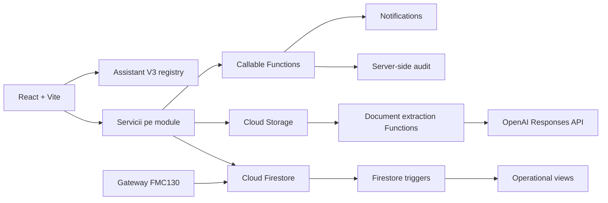

# WorkControl V4 - Master Audit

## 1. Rezumat executiv

Auditul a fost realizat pe codul din `main`, într-un worktree izolat, prin analiză statică,
verificări read-only în proiectul Firebase `workcontrol-53b1d` și consultarea documentației
oficiale Firebase/OpenAI. Nu au fost modificate aplicația, datele de producție, regulile,
gateway-ul GPS sau configurația de deploy.

WorkControl are deja o fundație utilă: servicii pe module, query-uri limitate în paginile
noi, Functions Node 22, Emulator Suite, testare Vitest/Playwright, extracție AI cu JSON
Schema strict și un asistent V3 cu registry de tool-uri. Riscul dominant nu mai este un
singur ecran care citește masiv, ci amplificarea de scrieri și trigger-e produsă de fluxul
GPS și de proiecțiile operaționale.

Măsurarea read-only din producție, la 14 iulie 2026, a arătat:

| Fereastră | Citiri | Scrieri | Function requests | Egress estimat |
| --- | ---: | ---: | ---: | ---: |
| 5 minute | 91 | 733 | 307 | 0,34 MiB |
| 15 minute | 372 | 2.145 | 735 | 1,37 MiB |
| 60 minute | 2.574 | 7.585 | 2.497 | 9,50 MiB |

În ultima oră, `syncVehicleOperationalView` a primit 2.282 requesturi, adică peste 91%
din requesturile Functions observate. Următorul consumator a fost
`syncUserOperationalViews`, cu 124 requesturi. Citirile sunt aproximativ 42,9/minut, dar
scrierile sunt aproximativ 126,4/minut. La acest ritm, aplicația depășește frecvent cota
gratuită de 20.000 scrieri/zi, chiar dacă numărul de utilizatori este mic.

## 2. Verdict pe domenii

| Domeniu | Stare | Observație principală |
| --- | --- | --- |
| Firestore reads | P1/P2 | Majoritatea paginilor noi sunt limitate; rămân liste și istorice fără limită. |
| Firestore writes | P0 cost | GPS + proiecția operațională generează amplificare continuă. |
| Functions | P1 cost | Rata actuală este aproape de plafonul gratuit lunar dacă rămâne constantă. |
| Securitate producție | P0 | Rules publicate sunt mai permisive decât rules locale întărite. |
| Documente | P1 | Există OCR/extracție, dar fără job universal, dedupe și review granular. |
| Notificări | P1 | Motorul funcționează, dar încarcă directoare complete și nu are un scheduler universal. |
| Asistent | P2 | V3 este controlat, dar nu are încă tool-uri document intelligence. |
| UX documente | P2 | Documentele sunt dispersate; lipsește inboxul și centrul de expirări. |
| GPS vizual | Protejat | Nu se recomandă nicio schimbare vizuală în roadmap-ul V4. |

## 3. Hartă de arhitectură

Separarea UI/servicii este prezentă în modulele principale, dar câteva servicii și pagini
sunt încă monolitice. Cele mai mari fișiere relevante sunt:

| Fișier | Linii aproximative | Risc |
| --- | ---: | --- |
| `functions/index.js` | 3.497 | Funcții fără granițe clare, risc de regresie și cold-start bundle. |
| `vehiclesService.ts` | 2.954 | CRUD, media, AI, GPS și cache într-un singur serviciu. |
| `VehicleLiveRouteCard.tsx` | 2.887 | Suprafață GPS critică; trebuie protejată de refactorizări V4. |
| `MaintenanceWorkspace.tsx` | 2.023 | Mai multe fluxuri într-un singur workspace. |
| `functions/securityActions.js` | 1.430 | Multe acțiuni privilegiate într-un singur modul. |
| `TimesheetsPage.tsx` | 1.181 | Tabel, filtre, rapoarte și acțiuni manageriale împreună. |
| `VehicleGpsMapsPage.tsx` | 1.141 | Flotă și orchestration GPS; nu se schimbă în acest program. |
| `ExpenseScanPage.tsx` | 1.055 | Upload, job, review și persistare într-o singură pagină. |

## 4. Probleme P0

### P0.1 - Rules publicate nu corespund fundației locale de securitate

Verificarea read-only a rules efectiv publicate a găsit reguli legacy de tip
`allow read, write: if isSignedIn()` pentru directoare interne. În repository există rules
mai restrictive, cu `companyId`, audit server-side și protecții pe rol. Asta înseamnă că
izolarea multi-company nu poate fi considerată activă până când migrarea, testele și
deploy-ul rules nu sunt finalizate în ordinea documentată.

Impact: citire/scriere cross-company, alterarea directoarelor interne și extinderea
suprafeței de atac dacă document intelligence este activat înaintea remedierii.

### P0.2 - Amplificare de scrieri GPS/proiecții

Gateway-ul scrie snapshotul live frecvent în mișcare, iar orice schimbare în documentul
vehiculului declanșează `syncVehicleOperationalView`. Proiecția include câmpuri volatile,
inclusiv snapshot GPS și structuri mari de istoric. O singură poziție poate genera punct,
document de zi, update pe vehicul, trigger și update de proiecție.

Remedierea trebuie să fie un task separat, cu testare vizuală GPS și măsurare înainte/după.
Nu trebuie schimbate gateway-ul FMC130, schema punctelor, simularea, jitter-ul, marker-ele,
polyline-ul sau incremental sync în cadrul document intelligence.

## 5. Probleme P1

1. `getTimesheetsList()` citește lista completă, fără limită.
2. `getVehicleEvents()` și `getToolEvents()` nu au limită/paginare.
3. `getUsersList()` din Scule și listele de utilizatori/firme din Bonuri sunt nebounded.
4. `getMaintenanceReportHistory(clientId)` poate crește nelimitat.
5. ștergerea unui document de vehicul nu șterge obiectul Storage.
6. `checkVehicleMaintenanceAlerts` scanează toate vehiculele la fiecare oră.
7. contextul notificărilor citește toți utilizatorii și toate regulile active înainte de
   filtrarea pe companie.
8. documentele vehiculului sunt array în documentul vehiculului; orice modificare rescrie
   array-ul și încarcă metadatele în liste unde nu sunt necesare.
9. extracția documentelor vehiculului este secvențială și nu are hash, versiune sau retry
   idempotent.
10. joburile de bonuri nu au dedupe, TTL, retry controlat sau versiune de extractor.

## 5.1 Dependențe și bundle

`npm audit --omit=dev` raportează 6 vulnerabilități moderate tranzitive în `uuid`, prin
`gaxios`/`teeny-request`/`@google-cloud/storage`/`firebase-admin`. Remedierea sugerată de
npm cu `--force` ar face downgrade major la `firebase-admin@10.3.0` și nu este sigură.
Aceste vulnerabilități trebuie urmărite și rezolvate prin upgrade compatibil al lanțului,
nu prin force/downgrade în taskul V4.

Build-ul avertizează că bundle-ul Firebase minificat este mare, dar bugetele proiectului
trec: CSS 49,94/52 kB gzip, shell JS 49,94/82 kB, assistant 25,90/45 kB, fleet GPS
7,18/10 kB și Firebase vendor 172,17/190 kB. `qrReader` rămâne un candidat bun pentru
lazy-load strict pe pagina de scanare.

## 6. Top 20 consumatori probabili

Ordinea combină măsurarea din producție cu fan-out-ul static. Ea trebuie validată continuu
prin metrics, nu tratată ca factură exactă pe modul.

| # | Consumator | Tip | Dovadă / motiv |
| ---: | --- | --- | --- |
| 1 | `syncVehicleOperationalView` | Functions + writes | 2.282 requesturi/oră măsurate. |
| 2 | Gateway snapshot vehicul | Writes | Poate scrie la fiecare record în mișcare. |
| 3 | Gateway puncte `positions` | Writes + storage | Un document per punct păstrat. |
| 4 | Gateway document de zi | Writes | Update pe parent/chunk, suplimentar punctelor. |
| 5 | `syncUserOperationalViews` | Functions + writes | 124 requesturi/oră; include presence volatilă. |
| 6 | Vehicle detail/list listeners | Reads | 1-3 listeners, până la 250 vehicule după rol. |
| 7 | Harta tuturor GPS-urilor | Reads + egress | Proiecții flotă și trasee; cache-ul reduce, dar traseele sunt voluminoase. |
| 8 | Control Panel live metrics | Reads/Functions | Count/query metrics și callable periodic. |
| 9 | Notification context | Reads | Citește întreg `users` + toate rules active. |
| 10 | Vehicle maintenance hourly scan | Reads | Full scan `vehicles` la fiecare oră. |
| 11 | Timesheets manager | Reads | Până la 1.000 documente. |
| 12 | `getTimesheetsList()` | Reads | Fără limită. |
| 13 | Expense list | Reads | Până la 1.000 documente. |
| 14 | Maintenance clients listener | Reads | Până la 200 documente live. |
| 15 | Part orders listener | Reads | Până la 200 documente live. |
| 16 | Vehicle/tool event histories | Reads | Fără limită. |
| 17 | Maintenance report history/client | Reads | Fără limită. |
| 18 | Company directory | Reads | Unele subliste administrative nu au limite. |
| 19 | Audit/history page | Reads | Până la 800, plus listener opțional. |
| 20 | Backup/export din Control Panel | Reads | Full scans explicite, acceptabile doar manual/admin. |

## 7. Quick wins

1. Instrumentează writes/trigger per sursă și exclude câmpurile volatile din comparațiile
   proiecțiilor înainte de orice refactorizare mare.
2. Separă `vehicleOperationalViews` stabile de un document `vehicleLiveViews` mic.
3. Separă prezența utilizatorului de profilul operațional și aplică debounce/TTL.
4. Înlocuiește scanarea orară de vehicule cu `notificationSchedules` indexat după
   `nextRunAt`.
5. Adaugă `limit`, paginare și cursor pe istoricele nebounded.
6. Filtrează `users` și `notificationRules` server-side după companie.
7. Introdu colecții subordonate pentru documente în loc de array pe vehicul, păstrând un
   adaptor legacy temporar.
8. Adaugă hash SHA-256, `extractionVersion` și idempotency la toate joburile de documente.
9. Șterge Storage object prin Function tranzacțională/outbox la ștergerea documentului.
10. Nu activa document intelligence extins înainte de reconcilierea rules din producție.

## 7.1 Security review pentru documente și automatizări

| Control | Stare actuală | Acțiune obligatorie |
| --- | --- | --- |
| Ownership/company | implementat în servicii/rules locale, neconfirmat în rules production | migrare + deploy rules + teste cross-company |
| Storage access | rules locale scoping pe user/vehicul/client | păstrează deny default; testează fiecare path |
| Fișiere publice | URL-urile sunt stocate în documente | evită URL permanent public; acces prin rules/signed URL scurt |
| MIME/size | Storage are limite; UI/service sunt inconsistente | allowlist unică și limită identică client/server/rules |
| Functions auth | callable-urile AI verifică auth și context | App Check, rate limit, payload schema, company derivată server-side |
| Audit | fundația locală are server-side audit | production rules trebuie să interzică client writes |
| Delete/retention | expense cleanup există; vehicle docs pot rămâne orphan | outbox/job idempotent + politică retenție |
| Malware/quarantine | nu există flux dedicat | quarantine + scanning înainte de preview/procesare |
| Redaction | schema extrage câmpuri allowlisted | nu stoca OCR brut; maschează CNP/adrese/date nefolosite |
| Secrets | OpenAI key este Secret Manager/Functions | nu expune în client/loguri; rotație și least privilege |
| Notifications | allowlist/rate limit în fundația locală | dedupe, recipient company scope, template server-side |

Storage Rules locale sunt mai bune decât Firestore Rules publicate: avatar 5 MB, expenses
15 MB, imagini vehicul/scule 8 MB, documente vehicul 20 MB, rapoarte mentenanță 25 MB și
default deny. Totuși, lipsesc quarantine/malware și alinierea limitelor cu Functions
(document AI vehicul 18 MB).

## 7.2 Riscuri de date și cost la activarea AI

- o reanalizare automată la fiecare deschidere ar dubla costul și trebuie interzisă;
- PDF multipagină poate consuma mult mai mulți tokeni decât o imagine;
- URL-urile și textul OCR pot conține date personale;
- auto-apply poate suprascrie date verificate sau mai noi;
- o expirare extrasă greșit poate crea notificări repetate;
- legarea aceleiași facturi la expense și service poate crea duplicate financiare;
- joburile fără idempotency pot crea documente duplicate după retry.

## 8. Primele trei acțiuni recomandate

1. **Reducerea amplificării de writes și trigger-e**, cu gardă explicită
   `GPS_VISUAL_BEHAVIOR_EQUIVALENT`.
2. **Reconcilierea și publicarea controlată a izolării multi-company** din implementarea
   de securitate deja existentă; este gate obligatoriu înainte de document intelligence.
3. **Document Intelligence Core**, cu job universal, hash, review, versiune, audit și
   rollback, fără a conecta încă toate modulele.

## 9. Restricție GPS

Programul V4 nu modifică:

- gateway-ul FMC130;
- parsing-ul și payloadurile;
- simularea;
- filtrarea jitter;
- punctele, marker-ele și polyline-ul;
- schema traseelor;
- cache-ul și incremental sync-ul;
- comportamentul vizual al paginilor GPS.

Orice reducere de cost în fluxul GPS se livrează separat, cu backup, canary, metrici și
regresie vizuală. Obiectiv contractual: `GPS_FUNCTIONAL_DIFF_ZERO`.
